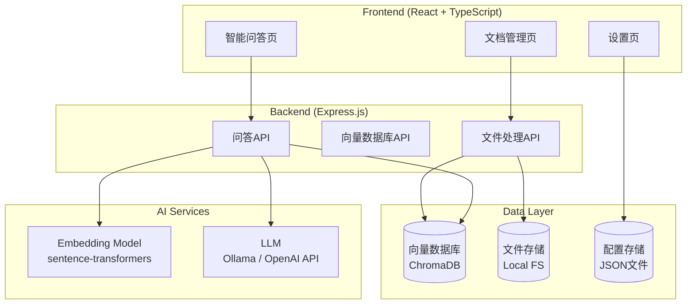
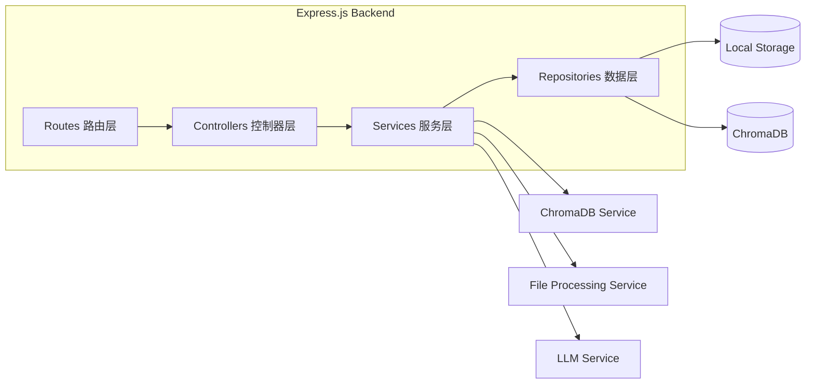
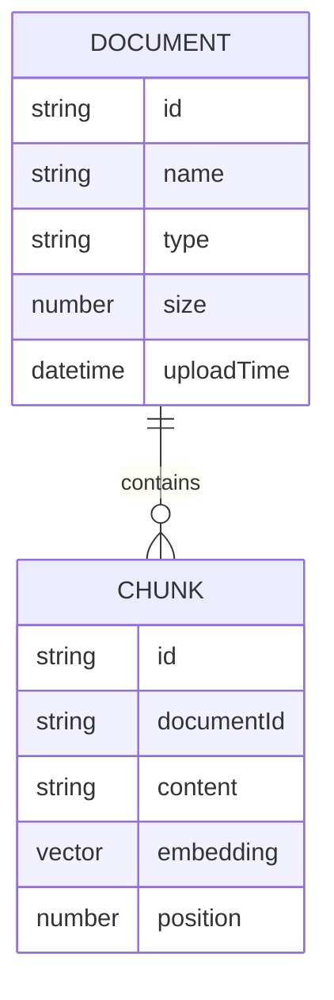

## 1. Architecture Design



## 2. Technology Description
- Frontend: React@18 + TypeScript + tailwindcss@3 + Vite + zustand
- Initialization Tool: vite-init (react-express-ts 模板)
- Backend: Express@4 + TypeScript
- Vector Database: ChromaDB (本地向量数据库)
- Embedding: sentence-transformers (通过 transformers.js 或 Python 后端)
- LLM: Ollama (本地) 或 OpenAI API (可选)
- File Processing: pdf-parse, mammoth, marked

## 3. Route Definitions
| Route | Purpose |
|-------|---------|
| / | 智能问答首页 |
| /documents | 文档管理页面 |
| /settings | 设置页面 |

## 4. API Definitions

```typescript
// 文档相关接口
interface Document {
  id: string;
  name: string;
  type: 'pdf' | 'txt' | 'md' | 'docx';
  size: number;
  uploadTime: string;
  chunkCount: number;
}

interface UploadDocumentResponse {
  success: boolean;
  document: Document;
}

// 问答相关接口
interface QueryRequest {
  question: string;
  topK: number;
}

interface QueryResponse {
  answer: string;
  sources: Array<{
    documentId: string;
    documentName: string;
    content: string;
    score: number;
  }>;
}

// 配置相关接口
interface AppConfig {
  llmProvider: 'ollama' | 'openai';
  ollamaModel?: string;
  ollamaBaseUrl?: string;
  openaiApiKey?: string;
  openaiModel?: string;
  chunkSize: number;
  chunkOverlap: number;
}
```

后端API路由：
- `POST /api/documents/upload` - 上传文档
- `GET /api/documents` - 获取文档列表
- `DELETE /api/documents/:id` - 删除文档
- `POST /api/query` - 提问
- `GET /api/config` - 获取配置
- `POST /api/config` - 保存配置

## 5. Server Architecture Diagram



## 6. Data Model

### 6.1 Data Model Definition



### 6.2 Data Definition Language

ChromaDB集合定义：
```javascript
// 创建文档集合
await chromaClient.createCollection({
  name: 'documents',
  metadata: { description: '用户上传文档的向量存储' }
});

// 配置存储 (JSON文件)
{
  "llmProvider": "ollama",
  "ollamaModel": "llama2",
  "ollamaBaseUrl": "http://localhost:11434",
  "chunkSize": 512,
  "chunkOverlap": 50
}
```

文件存储结构：
```
/workspace/data/
  ├── documents/
  │   ├── {doc-id}/
  │   │   ├── original.{ext}
  │   │   └── extracted.txt
  └── config.json
```
