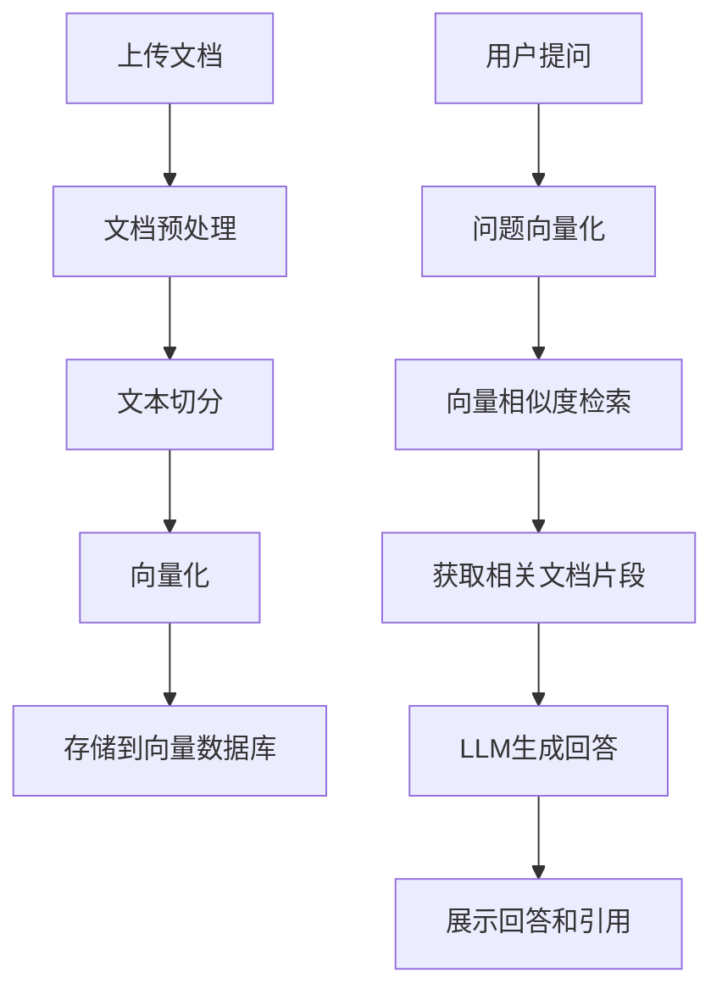

## 1. Product Overview
本地RAG智能问答系统，允许用户上传文档到本地向量数据库，并通过自然语言提问获取智能回答。
- 解决用户需要在个人文档库中进行高效检索和问答的需求
- 为个人用户提供轻量级、离线可用的AI知识库系统

## 2. Core Features

### 2.1 User Roles (if applicable)
无需多角色系统，单用户本地使用

### 2.2 Feature Module
1. **文档管理页**：文档上传、文档列表、文档预览
2. **智能问答页**：问题输入、回答展示、对话历史
3. **设置页**：模型配置、向量数据库设置

### 2.3 Page Details
| Page Name | Module Name | Feature description |
|-----------|-------------|---------------------|
| 文档管理页 | 文档上传 | 支持上传PDF、TXT、Markdown等格式文档 |
| 文档管理页 | 文档列表 | 显示已上传文档，支持删除和查看 |
| 智能问答页 | 问题输入 | 文本框输入自然语言问题 |
| 智能问答页 | 对话展示 | 流式输出回答，展示引用来源 |
| 设置页 | 配置管理 | 设置本地模型参数、向量数据库参数 |

## 3. Core Process
用户首先上传文档到系统，文档自动被切分并向量化存储在本地向量数据库中。当用户提问时，系统检索相关文档片段，结合大语言模型生成回答。

## 4. User Interface Design
### 4.1 Design Style
- 主色调：深蓝色 (#1e3a8a)，次色调：青色 (#06b6d4)
- 按钮风格：圆角矩形，轻微阴影，hover效果有轻微放大
- 字体：Inter 作为界面字体，JetBrains Mono 作为代码字体
- 布局风格：左侧导航栏 + 右侧内容区域的双栏布局
- 图标风格：使用 lucide-react 线性图标

### 4.2 Page Design Overview
| Page Name | Module Name | UI Elements |
|-----------|-------------|-------------|
| 文档管理页 | 文档上传 | 拖拽区域、文件选择按钮、上传进度条 |
| 文档管理页 | 文档列表 | 卡片式布局、图标、文件名、大小、上传时间 |
| 智能问答页 | 对话区域 | 聊天框样式、用户消息右对齐、AI消息左对齐、代码高亮 |
| 设置页 | 配置表单 | 输入框、选择器、保存按钮、状态提示 |

### 4.3 Responsiveness
桌面端优先设计，支持响应式布局，在平板和移动端自动调整为单栏布局，导航栏变为顶部汉堡菜单。

### 4.4 3D Scene Guidance (if applicable)
本项目不涉及3D场景
